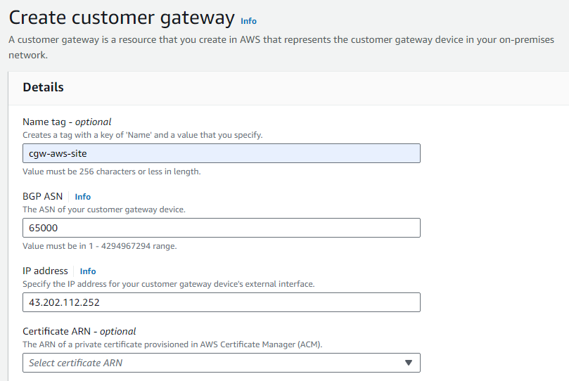
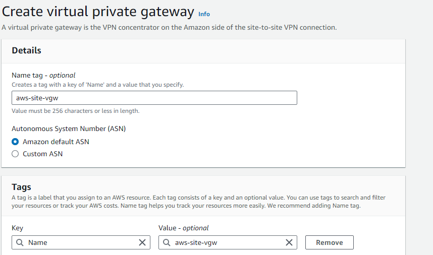
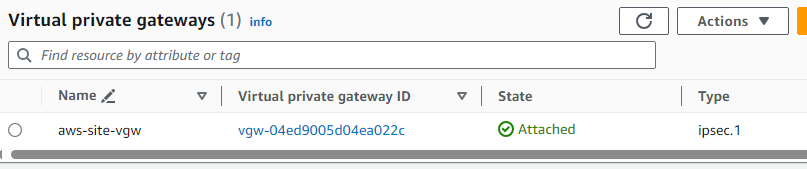
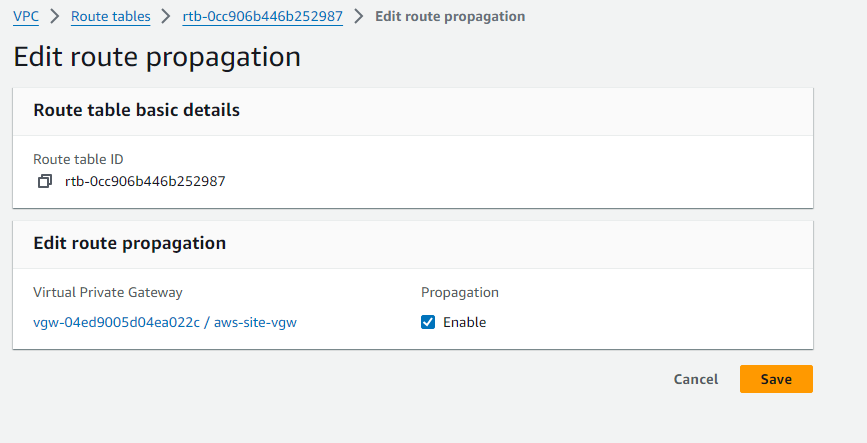
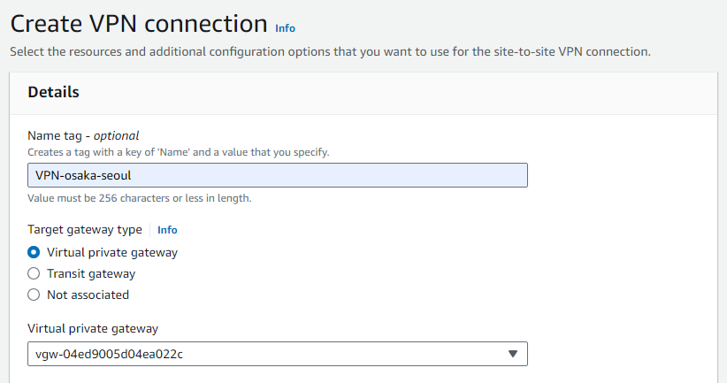
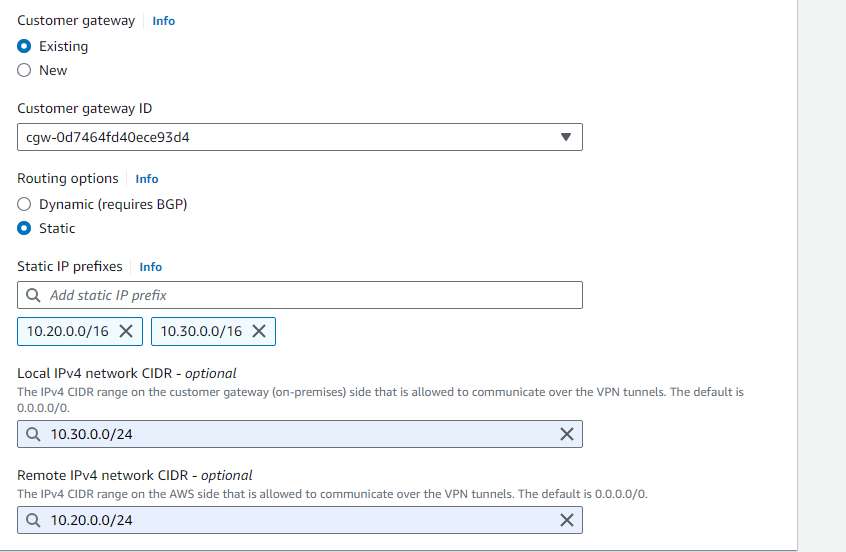
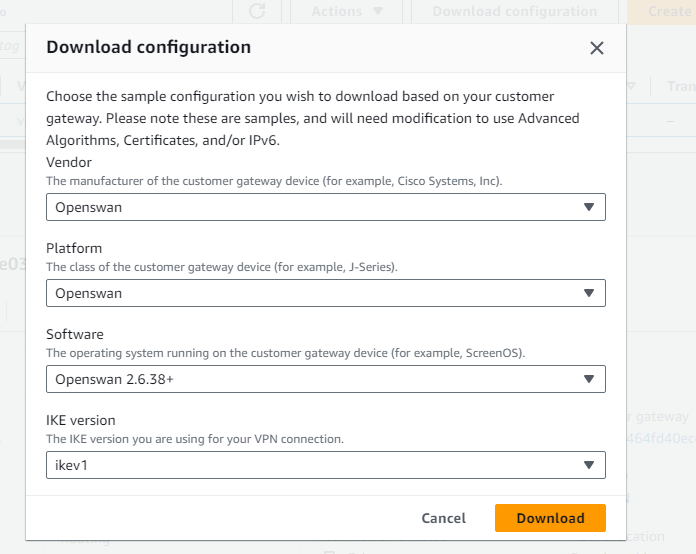
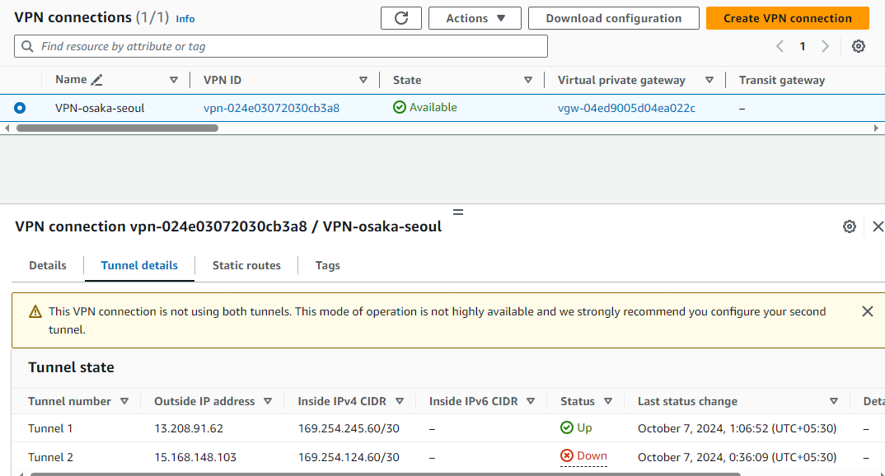
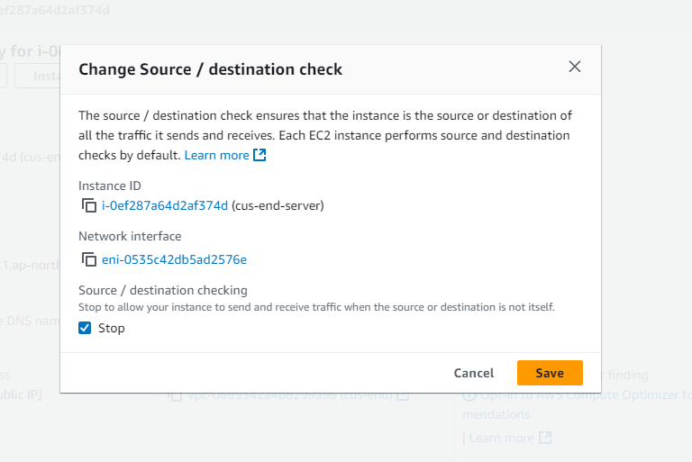
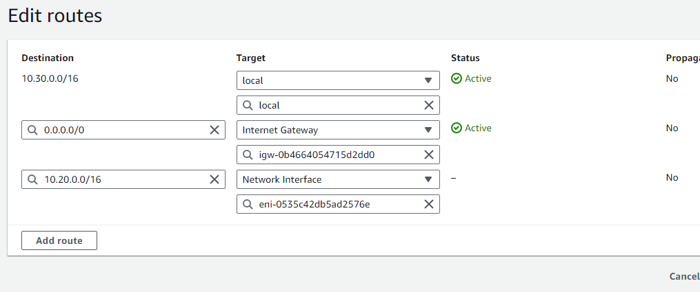

## Site to Site VPN (connecting ON-premise network to aws cloud network)

Step 1: Creating aws site VPC in region 1(osaka).

-> Create VPC with CIDR block 10.20.0.0/16


-> Add subnet with CIDR 10.20.0.0/24


-> Create Internet Gateway and attach to VPC.


-> Create route table name aws-RT and associated respective subnet to it.


-> add IG route to aws-RT table


Step 2: Creating customer end (cus-end) VPC in region 2(Seoul).

-> Create VPC with CIDR block 10.30.0.0/16


-> Add subnet with CIDR 10.30.0.0/24


-> Create route table name cus-RT and associated respective subnet to it.


-> Create Internet Gateway and attach to VPC.


-> -> add IG route to cus-RT table


Step 3: Create two instancea, one in  Seoul region and another in Osaka region with following configuration .

-> AMI image


-> Security Groups

  port          | source
  SSH (22)      |  0.0.0.0/0
  ALL TCP       |  10.0.0.0/8
  ALL ICMP IPv4 |  10.0.0.0/8 


-> launch instance


Step 4: Creating the site to site VPN connection.

-> Create Customer Gateway in aws-site i.e osaka region  using public ip of customerend server (seoul region)



-> Create Virtual Private Gateway in aws-site i.e osaka region and attach to VPC.





->  Go to route table and enable route propogation(Actions - edit route propogation - enable -save)




-> Create site to site vpn in aws-site i.e osaka region

    ➔Select Virtual Private Gateway
    ➔Select Customer Gateway
    ➔Routing Options
    ➔Static
    ➔Static IP prefix.
    ➔10.20.0.0/16
    ➔10.30.0.0/24
    ➔Local IPv4 network CIDR 
    ➔10.30.0.0/24 ……………. Use Seoul Subnet CIDR
    ➔ Remote IPv4 network CIDR
    ➔10.20.0.0/24 ……………… Use Osaka Subnet CIDR
    ➔Create VPN Connection





-> Download Configuration file of created VPN



Step 4:  Connecting to Customer Server(Seoul Server) through SSH

-> Run following commands to install openswan

```
sudo -i
yum install openswan -y

```

-> Follow all the steps from the downloaded openswan Configuration File for Tunnel 1

1) Open /etc/sysctl.conf and ensure that its values match the following:

```
net.ipv4.ip_forward = 1
net.ipv4.conf.default.rp_filter = 0
net.ipv4.conf.default.accept_source_route = 0
```

2) Apply the changes in step 1 by executing the command 

```
sysctl -p
```

3) Open /etc/ipsec.conf and look for the line below. Ensure that the # in front of the line has been removed, then save and exit the file.

```
#include /etc/ipsec.d/*.conf
```

4) Create a new file at /etc/ipsec.d/aws.conf if doesn't already exist, and then open it. Append the following configuration to the end in the file:
 #leftsubnet= is the local network behind your openswan server, and you will need to replace the <LOCAL NETWORK> below with this value (don't include the brackets). If you have multiple subnets, you can use 0.0.0.0/0 instead.
 #rightsubnet= is the remote network on the other side of your VPN tunnel that you wish to have connectivity with, and you will need to replace <REMOTE NETWORK> with this value (don't include brackets).

 Note :  Remove “auth=esp ”

```
conn Tunnel1
	authby=secret
	auto=start
	left=%defaultroute
	leftid=43.202.112.252
	right=13.208.91.62
	type=tunnel
	ikelifetime=8h
	keylife=1h
	phase2alg=aes128-sha1;modp1024
	ike=aes128-sha1;modp1024
	keyingtries=%forever
	keyexchange=ike
	leftsubnet=<LOCAL NETWORK>   ---> use cus-end (Seoul) VPC CIDR
	rightsubnet=<REMOTE NETWORK>  ---> use aws-site (Osaka) VPC CIDR
	dpddelay=10
	dpdtimeout=30
	dpdaction=restart_by_peer
```

5) Create a new file at /etc/ipsec.d/aws.secrets if it doesn't already exist, and append this line to the file (be mindful of the spacing!):

```
43.202.112.252 13.208.91.62: PSK "qG7Qqp.UyDm1Q3hbpHtFtbIdvcZMOWQd"
```

-> start the ipsec service

```
systemctl start ipsec.service
```

```
systemctl status ipsec.service
```

```
systemctl restart ipsec.service
```

.png>)



Step 5: Go to customer end server (Seoul Server) and do the following settings.

 ➔Select Instance 

 ➔Actions

 ➔Networking

 ➔Change source / Destination Check

 ➔ ” Stop” And Save 

 

 Step 6: Add network interface route to cust-RT table in cus-end VPC i.e Seoul Region.

 

 Step 7: Testing the Connection of tunnel

 -> ping the private ip of osaka from seoul.

.png>)

-> connecting to seoul instance with private  ip

.png>)


###############################################