##################Site to Site VPN (connecting ON-premise network to aws cloud network)##############

Step 1: Creating aws site VPC in region 1(osaka).

-> Create VPC with CIDR block 10.20.0.0/16

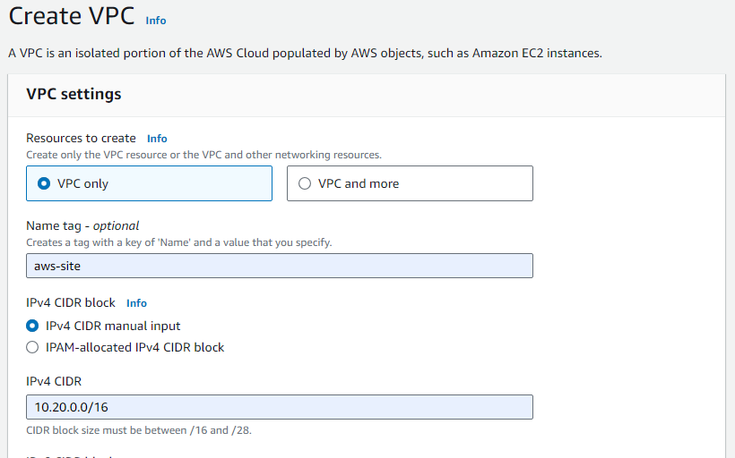

-> Add subnet with CIDR 10.20.0.0/24

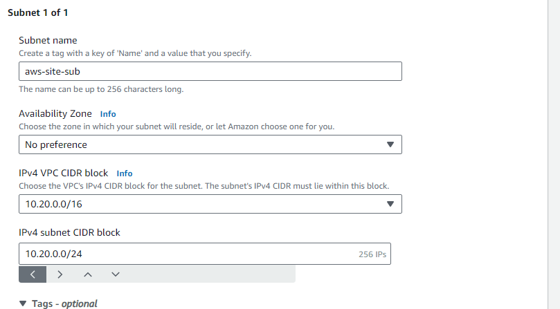

-> Create Internet Gateway and attach to VPC.

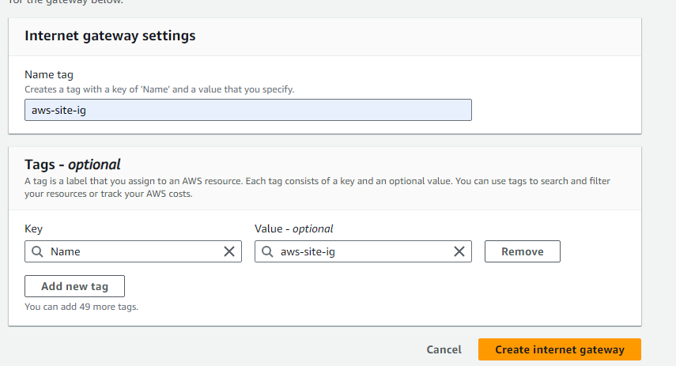

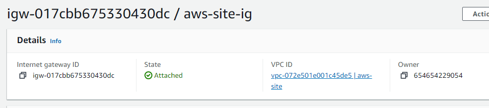

-> Create route table name aws-RT and associated respective subnet to it.

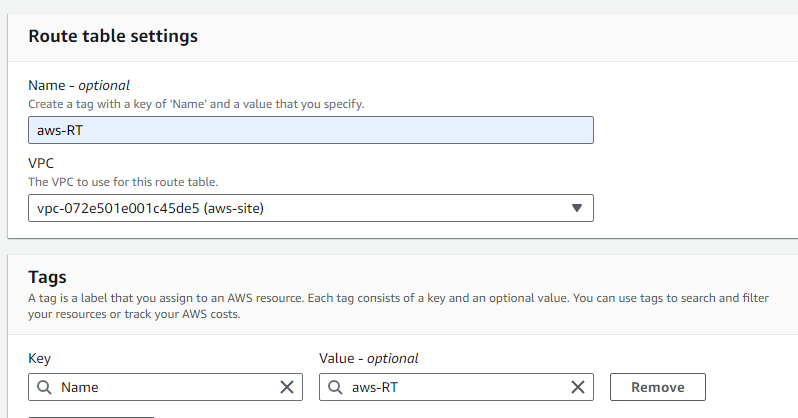

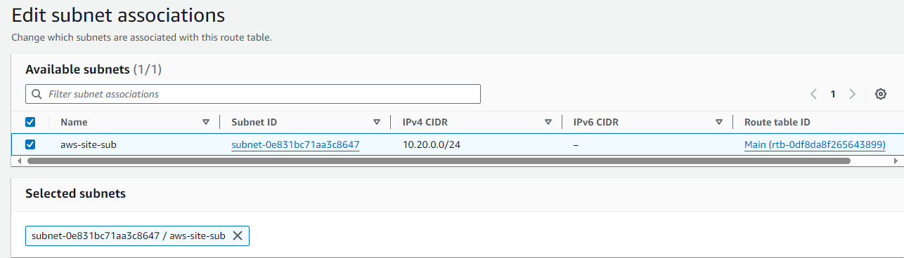

-> add IG route to aws-RT table

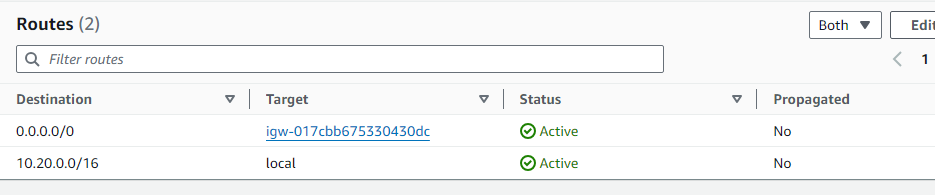

Step 2: Creating customer end (cus-end) VPC in region 2(Seoul).

-> Create VPC with CIDR block 10.30.0.0/16

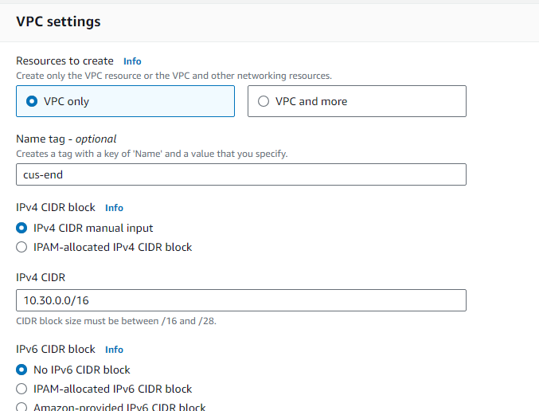

-> Add subnet with CIDR 10.30.0.0/24

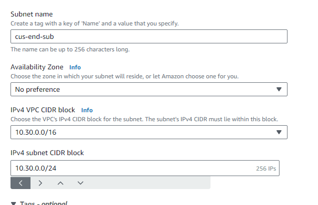

-> Create route table name cus-RT and associated respective subnet to it.

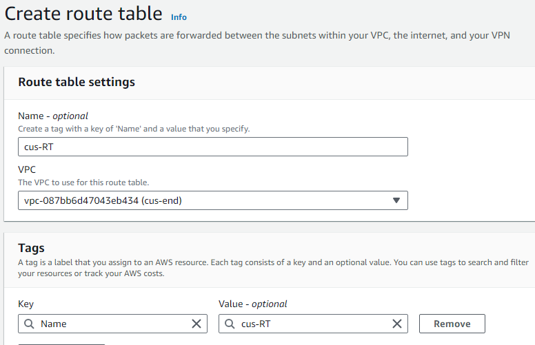

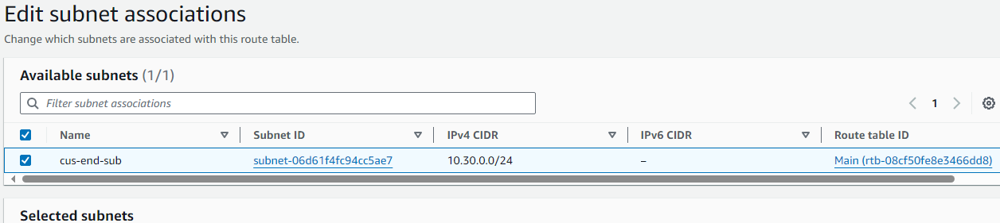

-> Create Internet Gateway and attach to VPC.

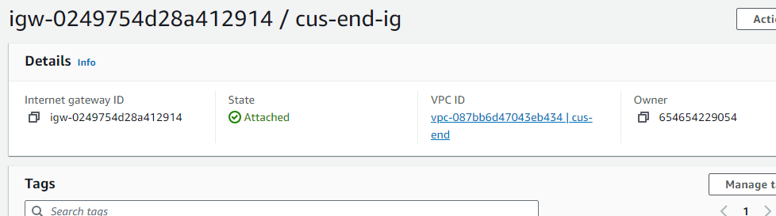

-> -> add IG route to cus-RT table

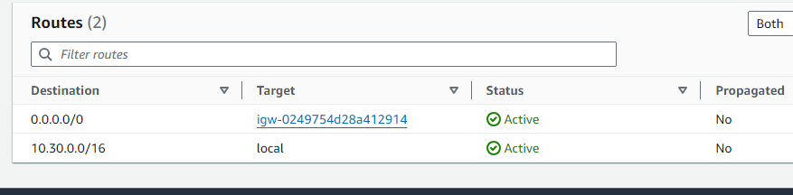

Step 3: Create instance in Seoul region.

-> AMI image

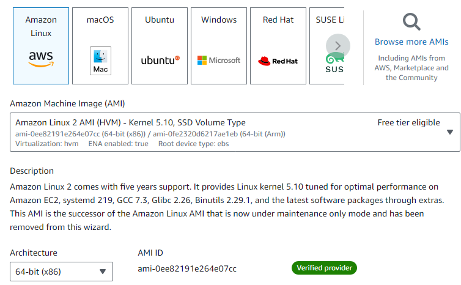

-> Security Groups

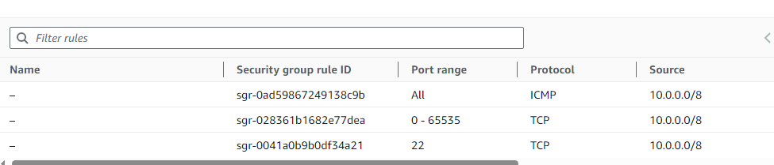

-> launch instance

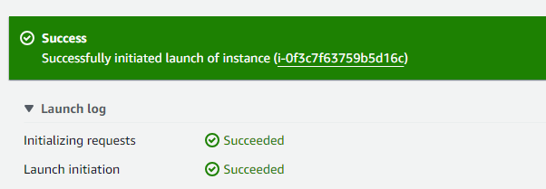

Step 4: Create VPN Connections.vpn 