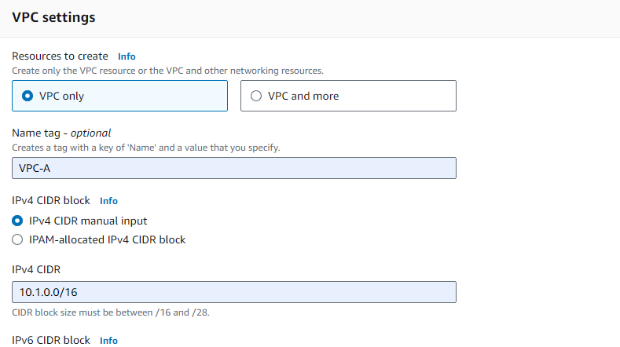
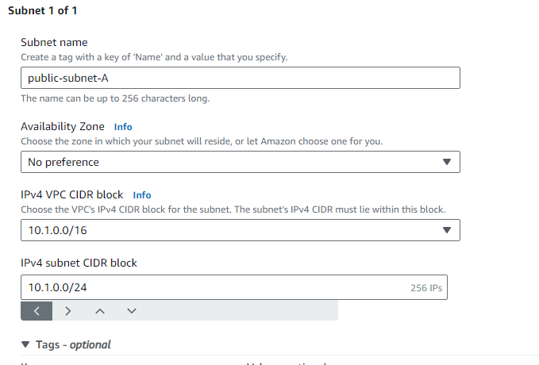
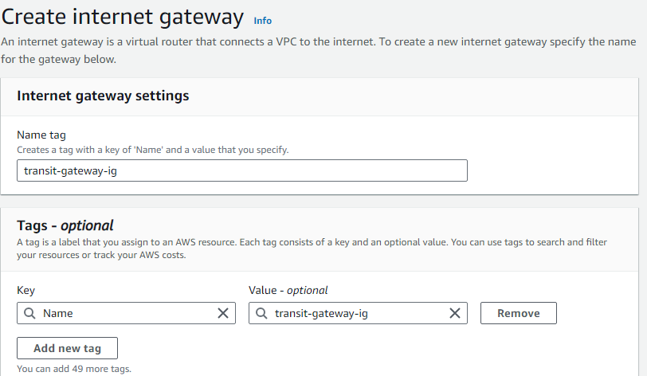
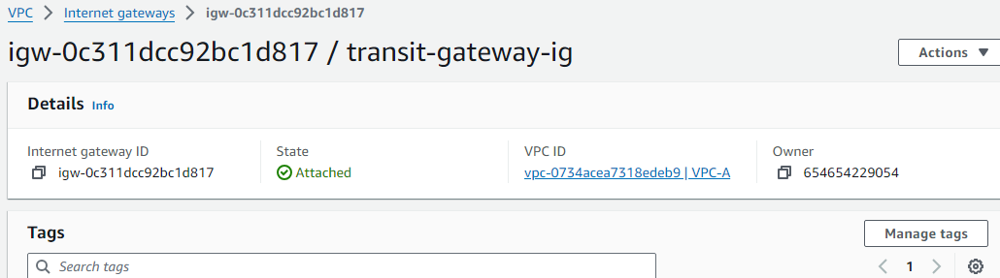

##################Transit Gateway#################################

Step 1: Confiuring the VPC A.

-> Create Vpc-A in with CIDR 10.1.0.0/16 

-> Create public subnet A with CIDR 10.1.0.0/24 

-> Create Internet Gateway  and attach to VPC A.

