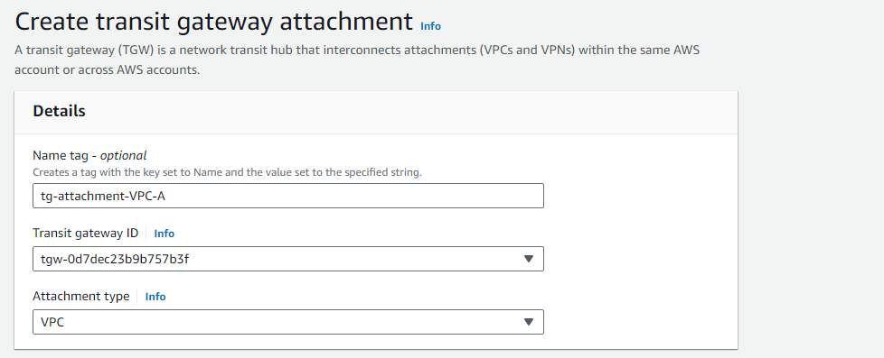

##################Transit Gateway#################################

Step 1: Confiuring the VPC A.

-> Create Vpc-A in with CIDR 10.1.0.0/16 

-> Create public subnet A with CIDR 10.1.0.0/24 

-> Create Internet Gateway  and attach to VPC A.

-> Add subnet association to route table of VPC.

-> add route of internet gateway to route table

Step 2: Similarly create VPC B with CIDR 10.2.0.0/16 and VPC C with 10.3.0.0/16 with private subnets 10.2.0.0/24 and 10.3.0.0/24 respectively  and add subnet associations.

Step 3: Create instance in each VPC

-> public instance security groups:

SSH     --->       0.0.0.0/0

ALL Traffic  -->   10.0.0.0/8 

->  -> private instance security groups:

ALL Traffic  -->   10.0.0.0/8 

Step 4: Create Transit Gateway

Step 5: create a Transit Gateway attachment for each VPC

-> All the attachments:

Step 6: Adding routes for transit gateway to each route tables.

-> public route table A

-> private route table B

-> private route table C

Step 7: Connect to public instance A through SSH

Step 8: ping the private instance inside the public instance

-> ping private instance B with private ip 10.2.0.232

-> -> ping private instance B with private ip 10.3.0.130

###############THE END#########################