###############Statichosting S3 bucket with cloudfront, Route53, SSL certificate##########################

Step 1 : Assigning NameServer of AWS on Hostinger

    -> It will take about 4-5 hrs.

Step 2 : Creating S3 bucket.

    -> Create bucket with name as given below as sudomain path in your bucket route.
             harryporter.swapnilbdevops.online  ---- example

    -> Grant Public Access

    -> enable pubic access in ACL and enable ACL

Step 3 : Assigning subdomain using Route53.

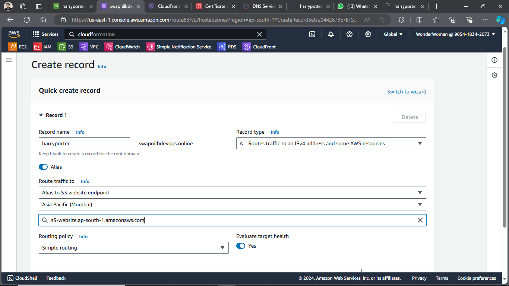

    -> Check if subdomain hits and give result.

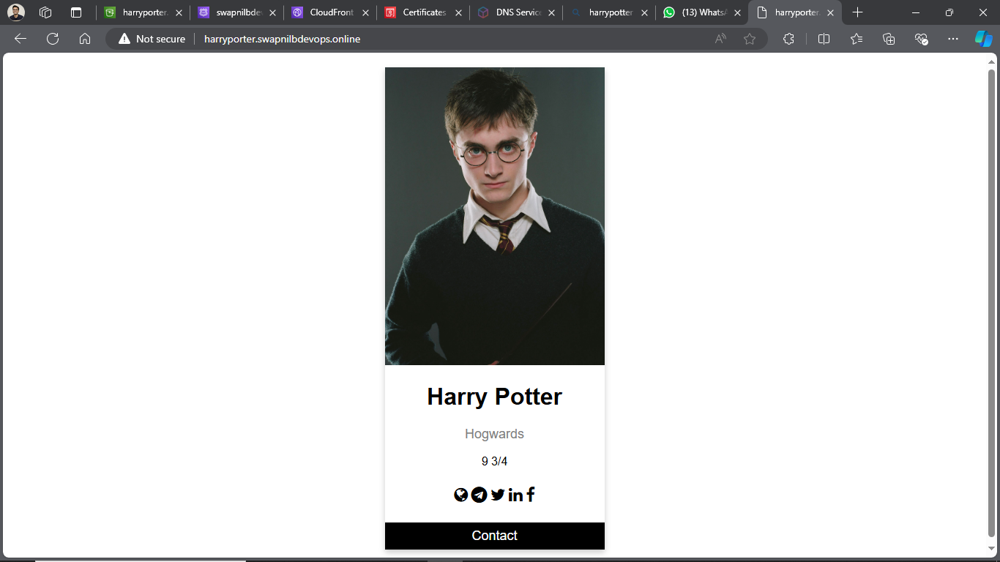

    -> Given subdomain hits but is not secure.

Step 4 : Creating Cloudfront Distribution.

    -> Select Origin name

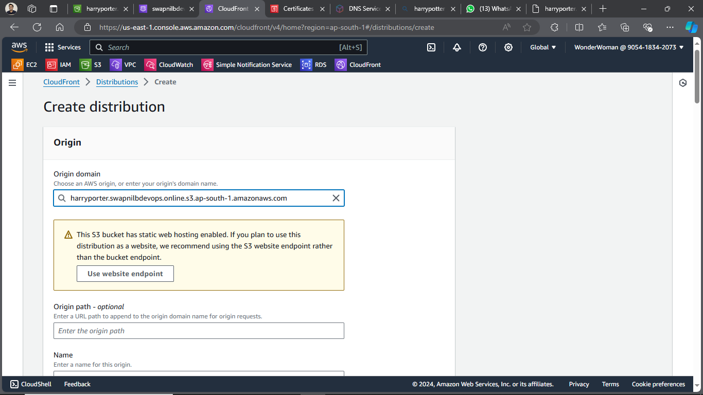

    -> Do not enable WAF service.

    -> Give Alternate domain name (CNAME)

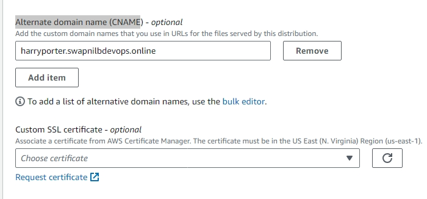

    -> Request certificate as given in step 5. and refresh and add newly created certificate.

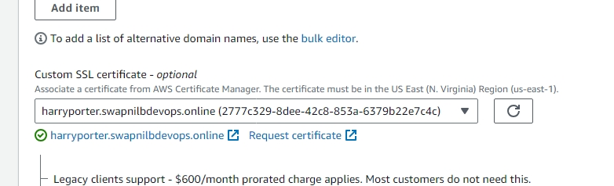

    -> Give default root object

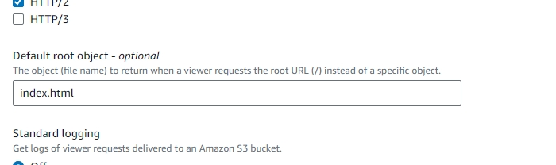

    -> Lastly  Create the distribution (it will take time since send request to every edge location server to store cache about target site)

Step 5 : Request SSL Certificate. (region will be on N. Virginia)

    -> request public certificate and give subdomain(buckets name) to certificate.

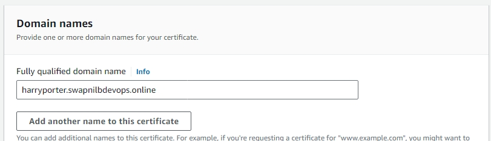

    -> Create Record in Route 53 to issue certificate.

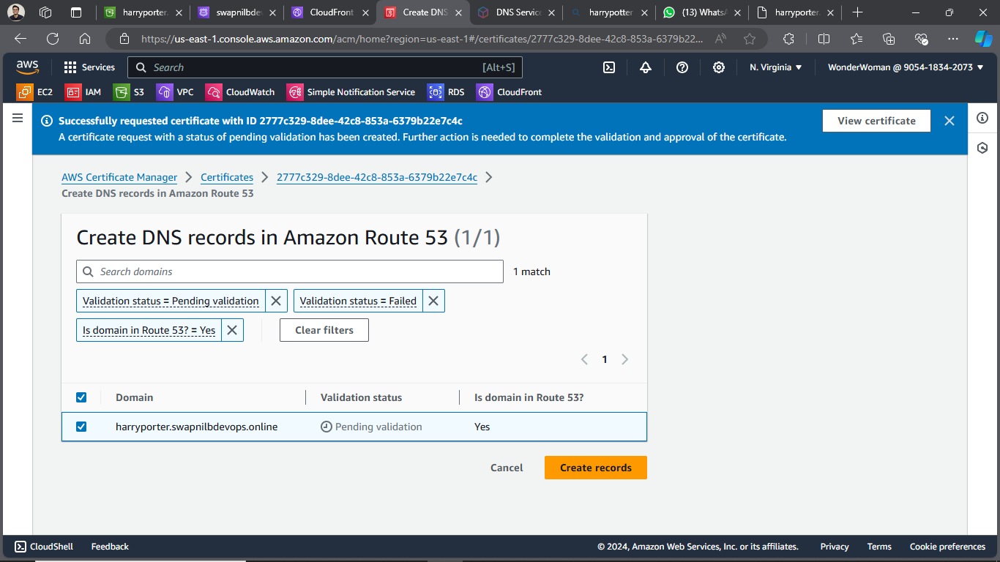

    -> After following steps certicate is issued.

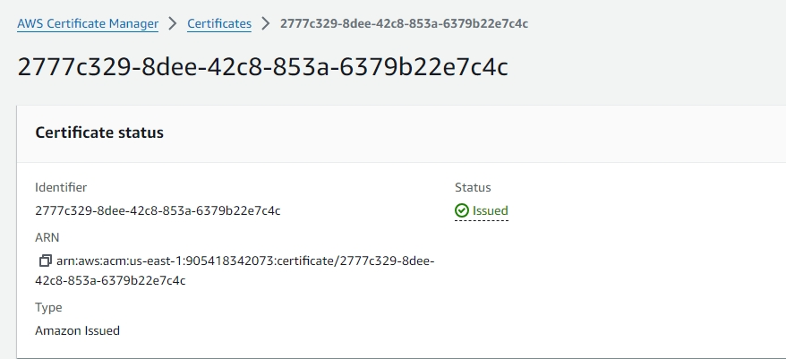

Step 6 : Edit S3 bucket record to add Cloudfront Distribution as below:

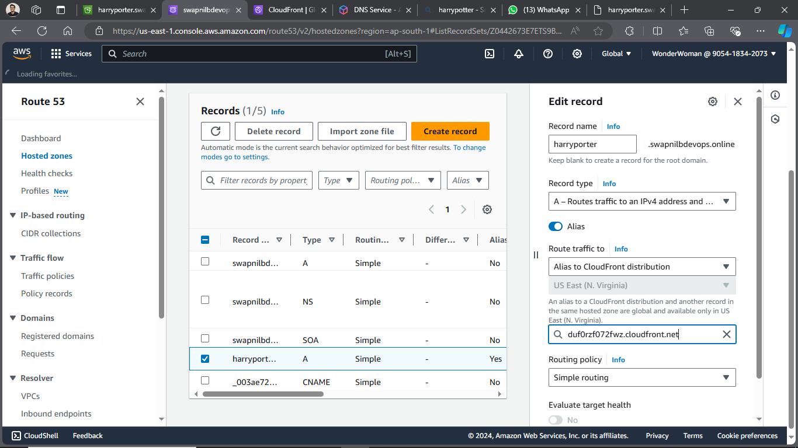

Step 7: Hit the subdomain and now since certificate is added, so it will open securely.

If it is unsecure add http:// in front of it.

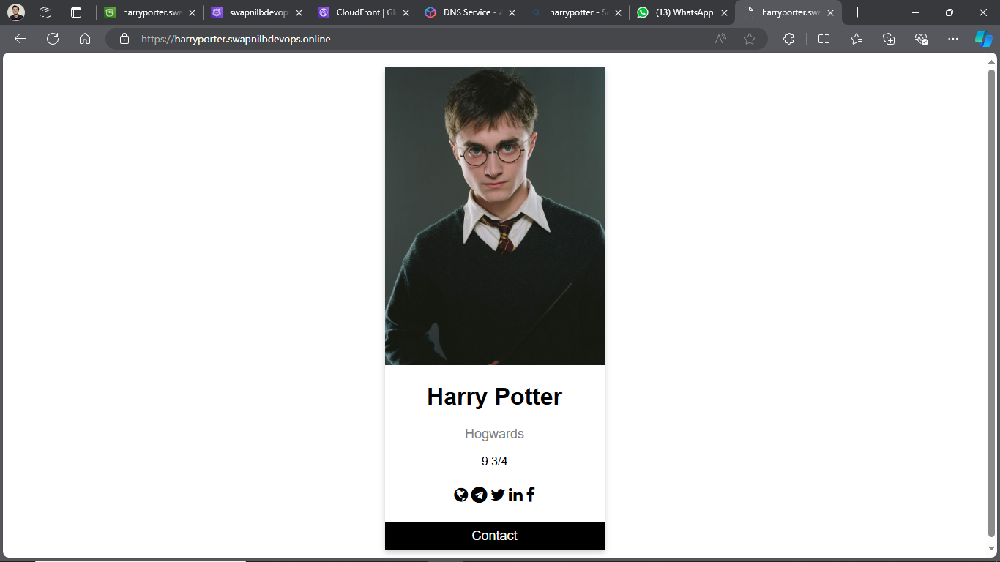
