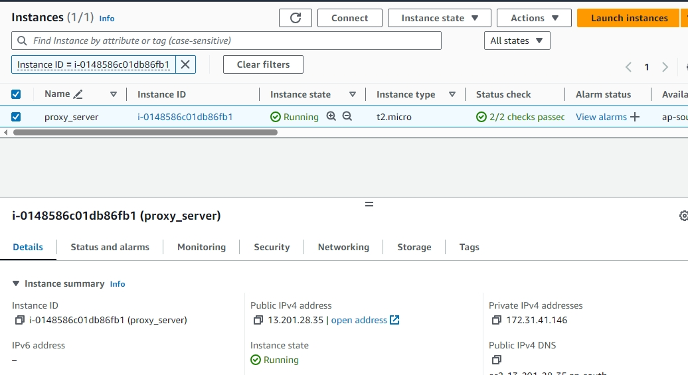

##################Nginx Proxy for Tomcat9 in ubuntu instance##########################

Step 1: Launch the ubuntu instance

    -> Add the require port to security groups.
        port: (ssh:22, http: 80, https:443, tomcat: 8080)

    -> Give instance appropriate name.

    -> Use MoboXterm terminal to access the instance.

Step 2: Install and start the Tomcat9 webserver.

      -> Upload  the project artifact file i.e. student.war

    -> download and extract appache tomcat9 tar file
      sudo wget https://dlcdn.apache.org/tomcat/tomcat-9/v9.0.93/bin/apache-tomcat-9.0.93.tar.gz
      sudo tar -xvf apache-tomcat-9.0.80.tar.gz

    -> move appache dir. to /opt dir
       sudo mv apache-tomcat-9.0.80 /opt/

    -> move student.war file to webapps dir
       sudo mv student.war /opt/apache-tomcat-9.0.80/webapps/

    -> sudo curl localhost:8080/student

     1. Install Java (OpenJDK):

    -> sudo apt update     # update the ubuntu packages
    -> sudo apt install openjdk-11-jdk -y   # Install OpenJDK 11(Java Runtime.)

     2. Download and Extract Tomcat 9:

    -> export VER="9.0.80"
    -> wget https://archive.apache.org/dist/tomcat/tomcat-9/v${VER}/bin/apache-tomcat-${VER}.tar.gz
    -> sudo tar xvf apache-tomcat-${VER}.tar.gz -C /usr/share/

     3. Create a symlink for easy updates:

    -> sudo ln -s /usr/share/apache-tomcat-$VER/ /usr/share/tomcat

     4. Update folder permissions:

    -> sudo chown -R ubuntu:ubuntu /usr/share/tomcat
    -> sudo chown -R ubuntu:ubuntu /usr/share/apache-tomcat-$VER/

     5. Manually Start Tomcat:

    -> sudo /usr/share/tomcat/bin/startup.sh       # terminal will show the tomcat server is started.

     6. Access Tomcat:

    -> http://your-instance-ip:8080/

    Optionals 1. Inspect the Tomcat logs for any errors:

    -> sudo tail -f /usr/share/tomcat/logs/catalina.out

    Optionals 2. If the service is still not found, create a custom systemd service for Tomcat:

      1. Create a file named /etc/systemd/system/tomcat.service with the following content

        [Unit]
        Description=Apache Tomcat 9
        After=network.target

        [Service]
        Type=forking
        ExecStart=/usr/share/tomcat/bin/startup.sh
        ExecStop=/usr/share/tomcat/bin/shutdown.sh
        User=tomcat
        Group=tomcat
        Restart=on-failure

        [Install]
        WantedBy=multi-user.target

      2. Reload systemd and start the service:

        sudo systemctl daemon-reload
        sudo systemctl start tomcat

Step 3: Using moboxterm, upload the student project.

    -> restart the server

Step 3: Installing and starting nginx

    -> sudo apt install nginx -y
    -> sudo systemctl start nginx
    -> sudo systemctl enable nginx

Step 4: create tomcat.conf file to set proxy for tomcat

    -> cd /etc/nginx/conf.d
    -> vim tomcat.conf

    -> add following configuration to tomcat.conf

    server {
    listen 80;
    server_name 13.201.52.52;

    location / {
        proxy_pass http://13.201.52.52:8080;
    }
    }

    -> systemctl restart nginx

Step 5 : Reboot instance and hit url at http:/instnce_ip/student
