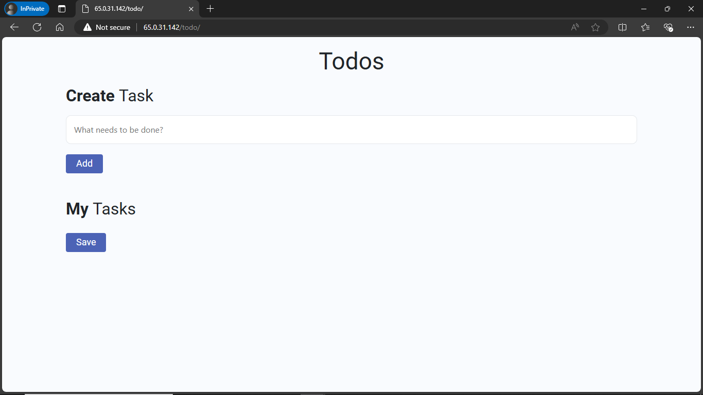
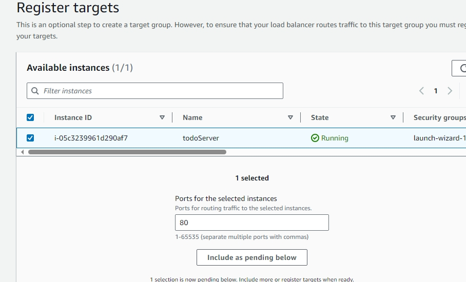
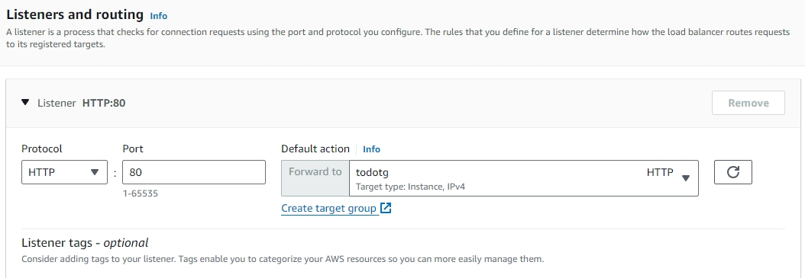
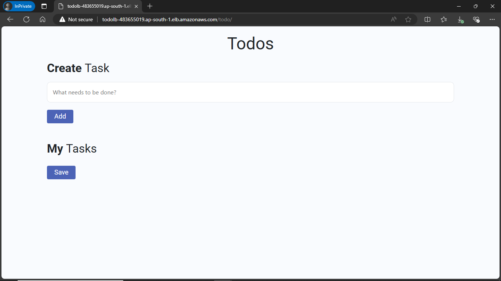
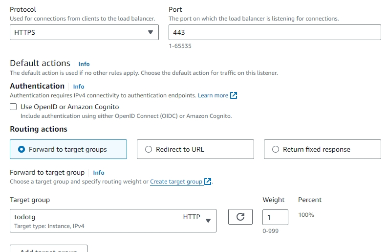
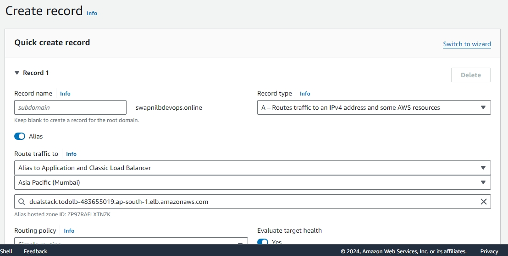
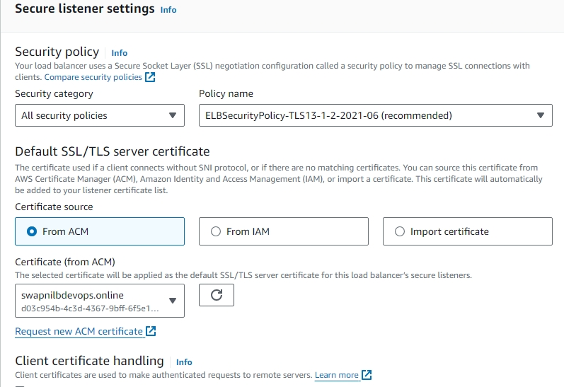
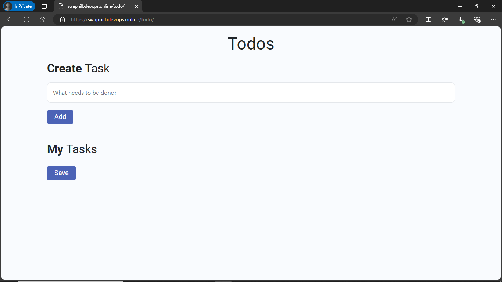
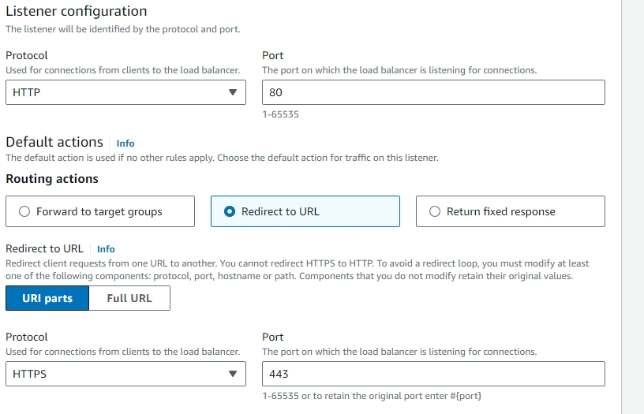

##############Creating load balancer endpoint for todo microservice using secure connection###############

Step 1 : Create EC2 instance & install httpd server in it.

    -> Script for launching httpd server

        #!/bin/bash
        yum update -y
        yum install httpd -y
        systemctl start httpd
        systemctl enable httpd

    -> upload file(zip) from local using moboXterm. and add static files to httpd dir.

    -> Add todo directory to httpd directory i.e.
        /var/www/html

    -> Copy ec2 public ip and check if todo app is working.
        65.0.31.142/todo/

Step 2 : Create Load balancer and add listener & target groups for ec2 instance.

    -> Creating application load balancer
      - Load balancer name = todolb
      - select subnets.
      - Listener and routing is done below.

    -> create target group
      - Give Name = todotg
      - type = instance
      - port = http(80)
      - Health check path = /todo/index.html
      - register target i.e. include require instance

    -> Add Listener to load balancer for http (unsecure connection).
      - Select Protocol and port, here it is http 80
      - Add created target group. as shown in below.

    -> hit the dns of load balancer as below

Step 3 : Create https listener & create add ssl certificate for secure connection.

    -> Add Listener to load balancer for https (secure connection).
      - Select Protocol and port, here it is https 443
      - Select same target group as for http listener.

    -> Create domain for load balancer using Route 53

    -> Create SSL certificate using ACM(AWS Certificate Manager) and add to listener.

    -> Create listener and hit lb_domain to see if connection is secure.
       if not add https:// in front of lb_domain.

Since We don't want unsecure connection, we'll redirect http 80 listener to https as shown below.

Step 4 : Redirecting http listener.

    -> Edit listener http 80 as shown.

    -> copy lbdomain add http:// in front of it and hit it and see the result.
