############ 2tier Application using Apache Tomcat and Aws mariadb RDS############

###Architecture:

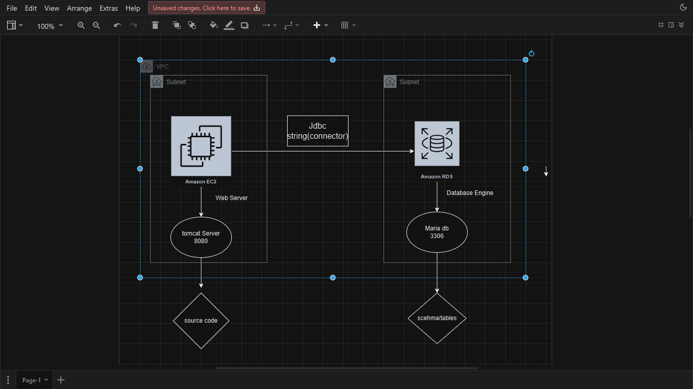

Step 1: Create database using RDS.

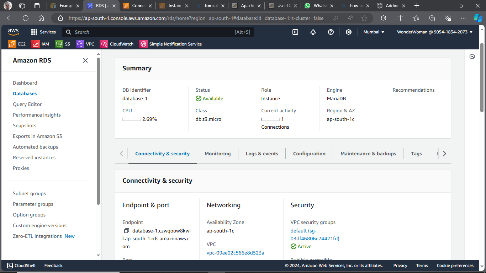

Step 2: Create and launch instance to host tomcat server.

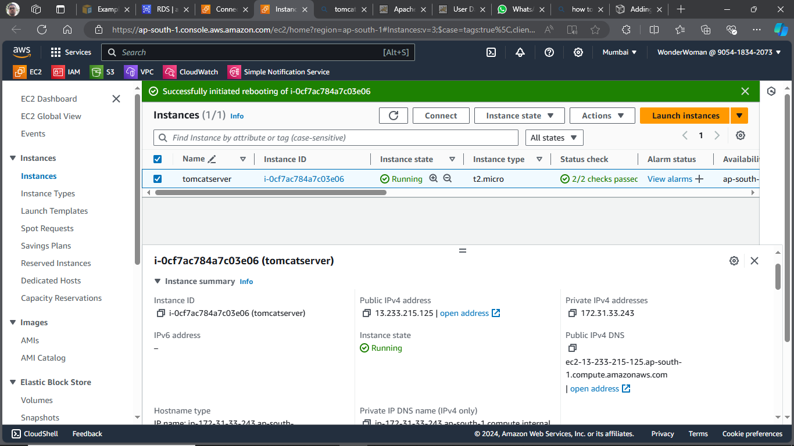

     -> Add following security groups:

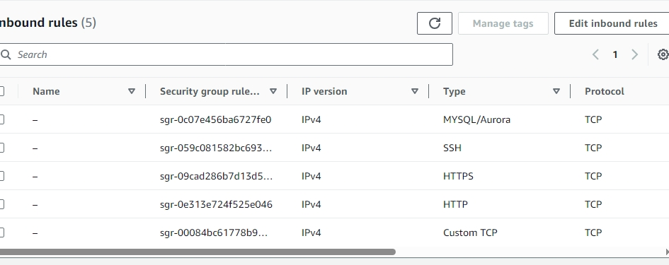

Step 3:Connect to instance using moboxterm teminal.

     -> switch to root user.

     -> upload the student.war (source code) and mysql-connector.jar (database connector) in moboxterm. (file will upload in local user home directory.)

Step 4: Get the third party application i.e. tomcat 9 from internet.

     -> Copy tar link from tomcat 9 website.

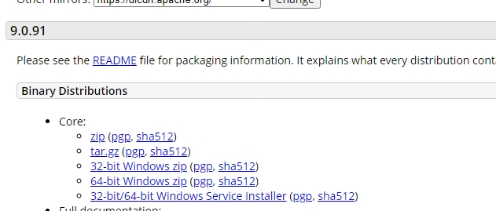

     -> download third party app using curl
        curl -O https://dlcdn.apache.org/tomcat/tomcat-9/v9.0.91/bin/apache-tomcat-9.0.91.tar.gz

     -> move the zip file to /opt/ directory.
       mv <source- ~/zipfile> <destination-/opt/>

     -> unzip file using tar command
       tar -xvf zipfile

Step 5: Add .jar and .war files i.e. artifacts to respective directory.

     -> Add .war file to webapps dirctory.

     -> Add .jar file to lib directory.

Step 6: Install Java and Mariadb Packages in tomcat instance

      -> Search and install Java
         yum search java
         yum search mariadb

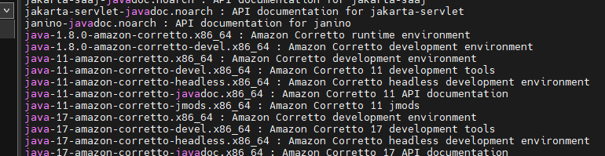

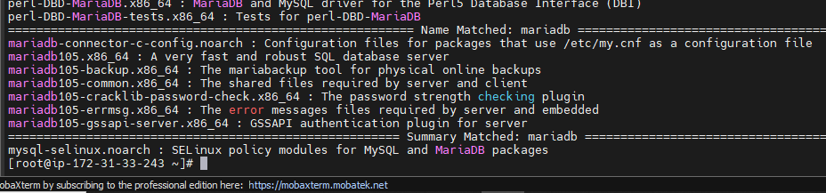

         yum install java-11-amazon-corretto.x86_64
         yum install mariadb105.x86_64

Step 7: Start the tomcat server to see if Front end is working.

     -> Go to  bin directory of apache tomcat & start  catalina.sh using bash command.
     i.e   bash catalina.sh start

     -> if tomcat start is seen on terminal then copy following link see if front end working.

     public ip/DNS:8080/appname(student)

     -> Now frontend is working but we're unable to add entry to database, so next step is to connect our app to database.

Step 8: Edit the context.xml file in conf directory with following text.

     -> edit your RDS username, password, db-endpoint, databasename in resource tag  and between context tag in context.xml

     vim context.xml(line no 21)
    		<Resource name="jdbc/TestDB" auth="Container" type="javax.sql.DataSource"
               maxTotal="100" maxIdle="30" maxWaitMillis="10000"
               username="USERNAME" password="PASSWORD" driverClassName="com.mysql.jdbc.Driver"
               url="jdbc:mysql://DB-ENDPOINT:3306/DATABASE"/>

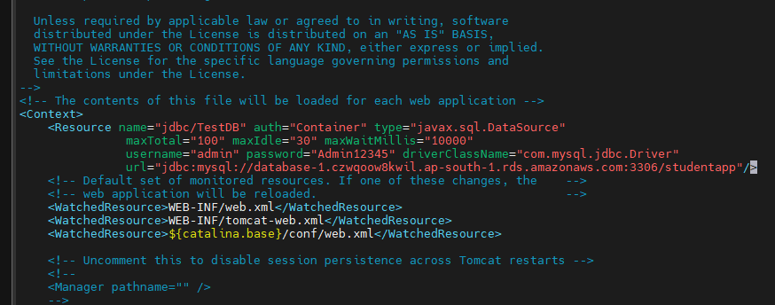

Step 9: login to database and create database and Add schema.

     -> login using following command:
       mysql -h db-endpoint -u user -ppassword

     -> to create database use:
        create database db_name;

     -> to use database:
        use db_name;

     -> Add following query to create table schema:

        CREATE TABLE if not exists students(student_id INT NOT NULL AUTO_INCREMENT,
    student_name VARCHAR(100) NOT NULL,
    student_addr VARCHAR(100) NOT NULL,
    student_age VARCHAR(3) NOT NULL,
    student_qual VARCHAR(20) NOT NULL,
    student_percent VARCHAR(10) NOT NULL,
    student_year_passed VARCHAR(10) NOT NULL,
    PRIMARY KEY (student_id)

);

    -> to see databases and tables use:

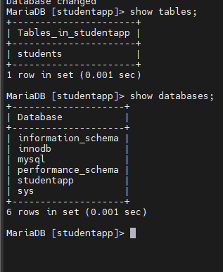

Step 10: Reboot the instance and start the tomcat server using catlina.

Step 11: Copy tomcat instance url and add the data to it and save. link would be like this:

     -> ec2-13-233-215-125.ap-south-1.compute.amazonaws.com:8080/student/

     -> output:

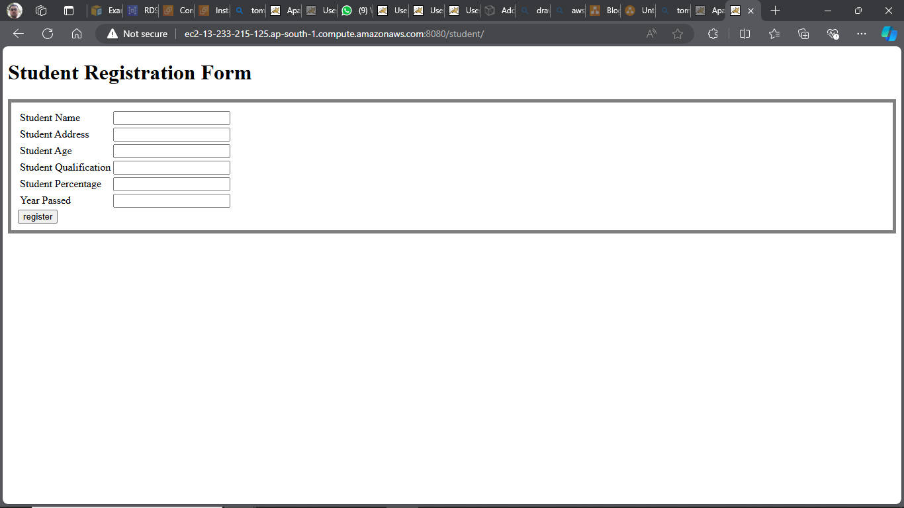

     -> Table entries:

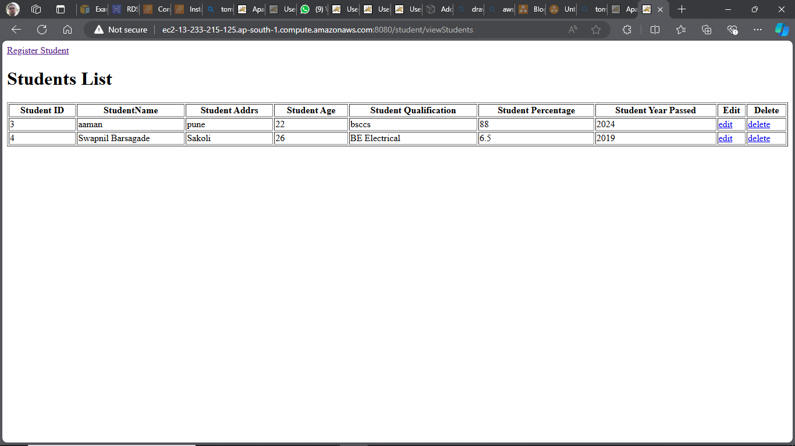
